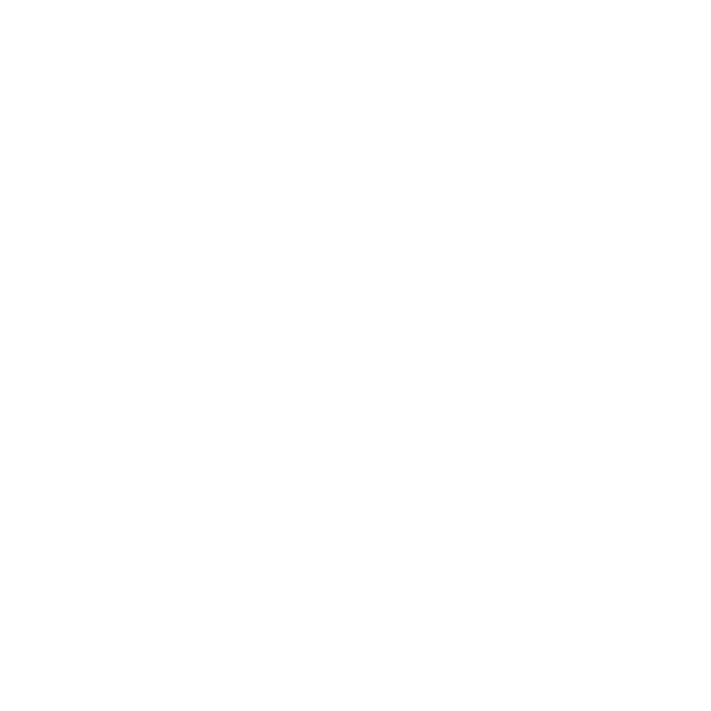
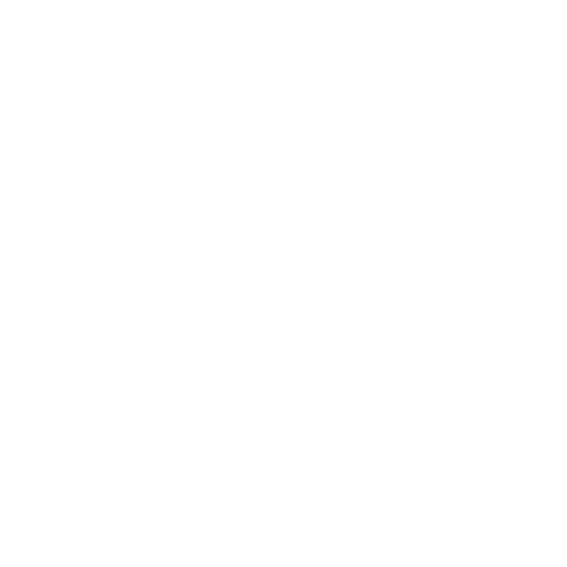
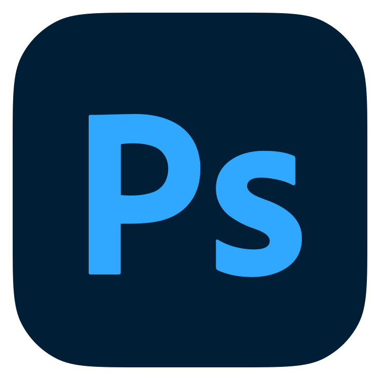
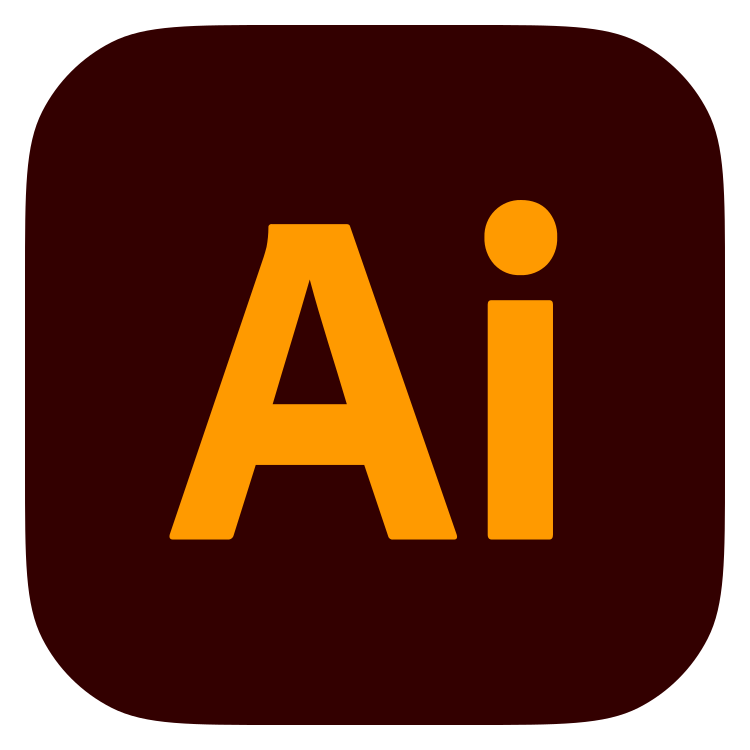
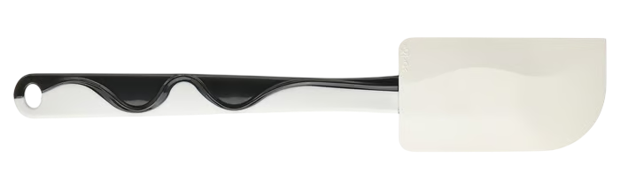

# Hi there 👋

I am **Nguyen NGUYEN**, from Switzerland. 
I am a software developper, graphic designer and I make cakes. 
 
Welcome to my profile !
  

## About me

* Occupation: Student at [42 Lausanne](https://42lausanne.ch/). Completed the Common Core in April 2026.
* Side activity: **Junior Web Developer** at [Junior 42 Lausanne](https://j42l.ch/).
* Hackathon: **Winner of AI Innovation Lab Hackathon**. The project, [AI Canva](https://github.com/TheOrangeCake/Cite-metier-2025/tree/main), was further developed for Cité des métiers Genève.
* Before 42:
  * Worked as a cook, which shaped my methodical and rigorous approach to development. This experience honed my attention to detail and stress resistance.
  * Freelance as Certified graphic designer. I take pride in my critical thinking and creative problem-solving skills.
* Cake: Yes I make cakes. My favorite is Orange cake.

 

## Technologies and tools

* Programming: 

 
 
* Frontend: 

 
 
* Backend: 

 
 
* DevOps/tools: 

 
 
* Design: 

 
 
* Favorite tool: 

 

## Featured projects

* [AI Canva](https://github.com/TheOrangeCake/Cite-metier-2025/tree/main): This educational game won first prize in the AI Innovation Lab Hackathon. It was further elaborated for use at Cité des Métiers 2025 in Geneva.
Through the game, we aim to show young users (ages 7 to 16) a glimpse of what AI can do in coding, while also highlighting its limitations. The game was played by hundreds of users during the event, and the feedback was very positive.
* [J42l website](https://www.j42l.ch): Official website for Junior 42 Lausanne. From A to Z: design, develop and deploy. This project code is proprietary.
* Suite42: Capstone project for 42 Common Core. Finished in April 2026. A micro-service web application designed to help student increase productivity.

 

## Contact me

* Email     : nguyennguyen.dev@protonmail.com
* Website   : [NguyenNguyen.ch](https://www.nguyennguyen.ch)
* Linkedin  : [Nguyen Nguyen](https://www.linkedin.com/in/)